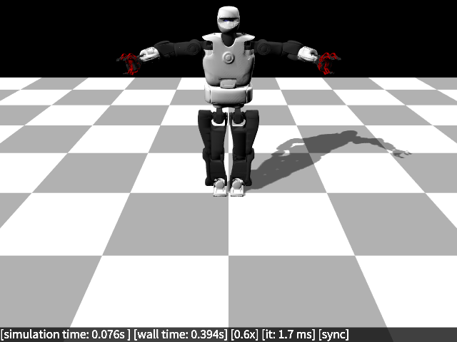
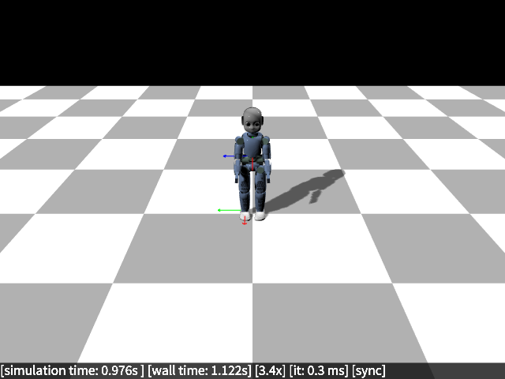
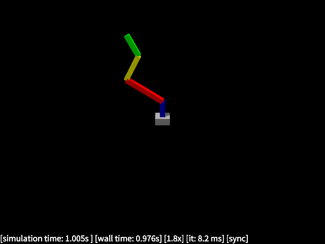

# Supported robots

Every robot is a defined as a URDF, which will be installed `$PREFIX/shared/robot_dart/robots`. Some robots (Talos, iCub) ehave predefined "Robot classes" that defines the sensors; for the others, you have to add the sensors to the generic robot class.

The URDF files are loaded using the following rules:

- First check in the current directory
- If not found, check in `current_directory/robots`
- If not found, check in the robot dart installation path/robots (e.g., `/usr/share/robot_dart/robots` or `$HOME/share/robot_dart/robots`)
- Otherwise, report failure

## Talos (PAL Robotics)
{: style="display: block;margin-left: auto;margin-right: auto;width:70%"}

Talos is a humanoid robot made by [PAL Robotics](https://pal-robotics.com/robots/talos/).

- Datasheet: [pdf](https://pal-robotics.com/wp-content/uploads/2019/07/Datasheet_TALOS.pdf)
- 32 degrees of freedom (6 for each leg, 7 for each arm, 2 for the waist, 2 for the neck, 1 for each gripper)
- 175 cm / 95 kg
- IMU in the torso
- Torque sensors in all joints except head, wrist and gripper (22 torque sensors total)
- 1 force/torque sensor in each ankle
- 1 force/torque sensor in each wrist

We have two URDF files:

- `robots/talos/talos.urdf` : 
    * accurate (simplified but made of polygons) collision meshes
    * mimic joints for the gripper
    * Not compatible the DART collision detector (you need to use FCLe
- `robot/talos/talos_fast.urdf`:
    * no collision except for the feet, which are approximate by boxes
    * grippers are fixed
    * compatible with the DART collision detector

`talos_fast.urdf` is faster because it makes it possible to use the DART collision detector. You should prefer it except if you want to use the grippers or are working on self-collisions.

*Please note that the mesh files (.glb) require assimp 5.x (and not assimp4.x shipped with ROS). If you cannot load the URDF, please check your assimp version.*

## Panda (Franka Emika)
{: style="display: block;margin-left: auto;margin-right: auto;width:70%"}

The Franka is a modern manipulator made by [Franka Emika Panda](https://www.franka.de/technology). It is commonly found in many robotics labs.

- Datasheet: [pdf](https://www.generationrobots.com/media/panda-franka-emika-datasheet.pdf)
- 7 degrees of freedom
- Can be controlled in torque
- 18 kg
- workspace: 855 mm (horizontal), 1190 mm (vertical)
The URDF includes the gripper.

## LBR Iiwa (KUKA)
{: style="display: block;margin-left: auto;margin-right: auto;width:70%"}

The LBR Iiwa is manufactured by [KUKA](https://www.kuka.com/en-de/products/robot-systems/industrial-robots/lbr-iiwa) . It is similar to the Panda and is also very common in robotics labs.

- Datasheet: [pdf](https://www.kuka.com/-/media/kuka-downloads/imported/6b77eecacfe542d3b736af377562ecaa/db_lbr_iiwa_en.pdf?rev=70ca3521eecc42b9b1a05d0e486119ba&hash=C3DDC2EFE649EFDF75E592892C466D6F)
- We implement the 14 kg version
- 29.5 kg
- 7 degrees of freedom

## Icub (IIT)
{: style="display: block;margin-left: auto;margin-right: auto;width:70%"}

The iCub is a open source humanoid robot made by the [Instituto Italiano di Tecnologia](https://icub.iit.it). There are currently 42 iCUbs in the world, and many versions.

- Datasheet (rev 2.3) [pdf](https://icub.iit.it/storage/documents/Technical-specs_iCub_robot_Rev_2.3_05082019.pdf)
- 6 force/torque sensors (upper arms, upper legs, ankles)
- IMU in the head
- We do to simulate the skin
- We do not simulate the hands
- Our model is close to the [Inria's iCub](https://members.loria.fr/JBMouret/robots.html), but it has not been checked in detail.

## Dynamixel-based hexapod robot (Inria and others)
{: style="display: block;margin-left: auto;margin-right: auto;width:70%"}

This hexapod is a simple 6-legged robot based on dynamixel actuators. It is similar to the robot used in the paper [`Robots that can adapt like animals'](https://www.nature.com/articles/nature14422).

- 6 legs, 3 degrees of freedom for each leg (18 degrees of freedom)

## Simple arm
{: style="display: block;margin-left: auto;margin-right: auto;width:70%"}

- A simple arm for educational or debugging purposes
- 5 degrees of freedom
- simple URDF

## How to use your own URDF?
